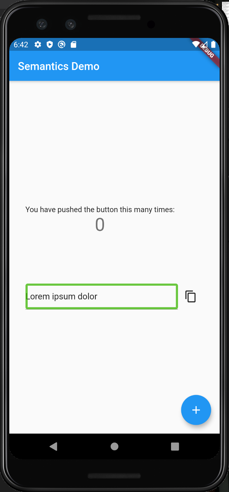

# Semantics class

The official Flutter documentation defines this class as:
>" A widget that annotates the widget tree with a description of the meaning of the widgets. Used by accessibility tools, search engines, and other semantic analysis software to determine the meaning of the application."

This explanation really sums up the functionality of the Semantics class but doesn't explain the importance this widget has in the process of developing an app and targeting a large and diverse userbase.

When we are involved in the process of designing our apps we often make the mistake of thinking about our potential users as people with our same set of characteristics. This situation can lead to our app missing a big source of users that may not find the functionality we provide enough for their own set of characteristics.

At this point Semantics makes its appearence, by using it to design our UIs we will have a very deep set of features that will keep our apps prepared to be used by people who may find difficulties using a device with a small screen.

This doesn't mean that without this class our app won't have accessibility features, many of Flutter's widgets have them implemented by default. So, why use Semantics then? Well, we should use the Semantics class when this default functionality is not enough.

Now that we understand the importance and use-cases of the Semantics class, let's get to work in some examples of its usage.

## The app



Our app has only one view with a simple UI, it has customized accesibility features implemented using Semantics and it's related classes.

In order to test this functionallity you'll need  to download TalkBack or VoiceOver, depending on your device's OS, and to activate the screen reader features from the settings.

Once we've done that, we will see a green rectangle over the interactable controls of the UI, like the one shown in the picture.

This is how we created our Semantics widget to override the **FloatingActionButton** accessibility features:

```dart
Semantics(
    hint: "Double tap to increase.",
    value: 'The counter current value is $_counter.',
    child: ExcludeSemantics(
    key: new Key("Counter button"),
    child: FloatingActionButton(
        onPressed: _incrementCounter,
        tooltip: 'Increment',
        child: Icon(Icons.add)),
    ),
)

```

With this code, with the first tap of this button, the screen reader will say:

> "*The counter value is zero. Double tap to increase*"

This will provide the user information about what is this control and what it will do when double tapped.

We use **ExcludeSemantics** to disable **FloatingActionButton**'s accessibility features, otherwise they will also be used along with the ones we configured. 
